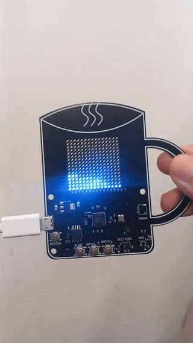
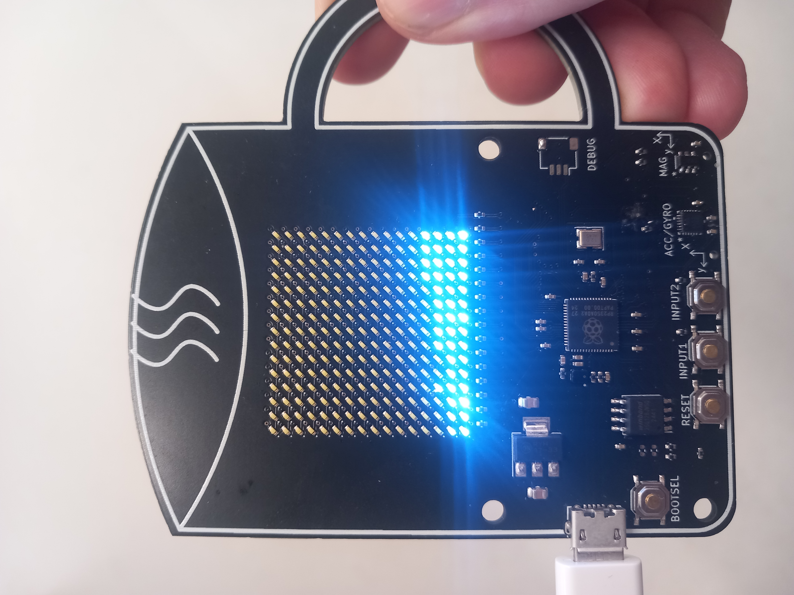

# cuppa

A RP2350 based gravity visualizer!
 * tilt Cuppa and see gravity impact the simulated fluid particles
 * stream state and covariance estimates, or sensor data, to a computer
 * disable/enable predict and update steps and see how it impacts Cuppa (re-upload code required)
 * change the code, build it, and upload it using the Raspberry Pi Pico extension in VS Code from the Raspberry Pi Foundation

 The `firmware` subfolder has the code that gets uploaded to Cuppa, build instructions in the README in the subfolder. The `client` subfolder as python code to run on computers connected to Cuppa, that can output the data to be built upon. It also includes example visualizations.

 ## System Model

We model the state space as three dimensional, including the x rotation $\phi$ the y rotation $\theta$ and the z rotation $\psi$. We use an Unscented Kalman Filter (UKF) to estimate the state, taking the gyroscope as the control input in the predict step where it conains the x rotation velocity, y rotational velocity, and z rotational velocity. This leads to state transition dynamics with the matrix A being the identity and the matrix B being the identity multiplied by the change in time $\Delta t$. The state space, control, and dynamics are given below:

$$
x \in \mathbb{R}^3\\  
x = \begin{bmatrix} \phi& \theta& \psi \end{bmatrix}^T \\  
u \in \mathbb{R}^3\\  
u = \begin{bmatrix} \dot{\phi}& \dot{\theta}& \dot{\psi} \end{bmatrix}^T \\  
A = I_3\\  
B = \Delta t I_3\\  
x_{t+1} = Ax_{t} + Bu_{t}\\  
$$

We use the accelerometer and model it by assuming zero linear acceleration acting on the body, therefore the acceleration the accelerometer measures is the rotated gravity vector. We predict it using the state estimate where $y_t$ is the predicted sensor measurement, $R_x$ is an x rotation matrix constructed using the state estimate of x rotation and $R_y$ is a y rotation matrix constructed using the state estimate of y rotation, and $a_g$ is the world frame gravity vector.

$$
y_t = R_x(\phi_t)^T (R_y(\theta_t)^T a_g)
$$

In the Unscented Kalman filter, we treat state subtraction specially given we use angles in the state. We also treat state expected values specially for this same reason.
