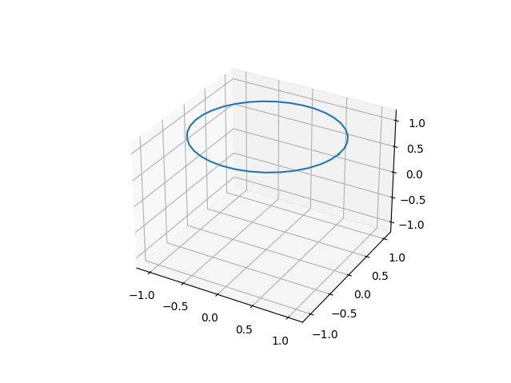
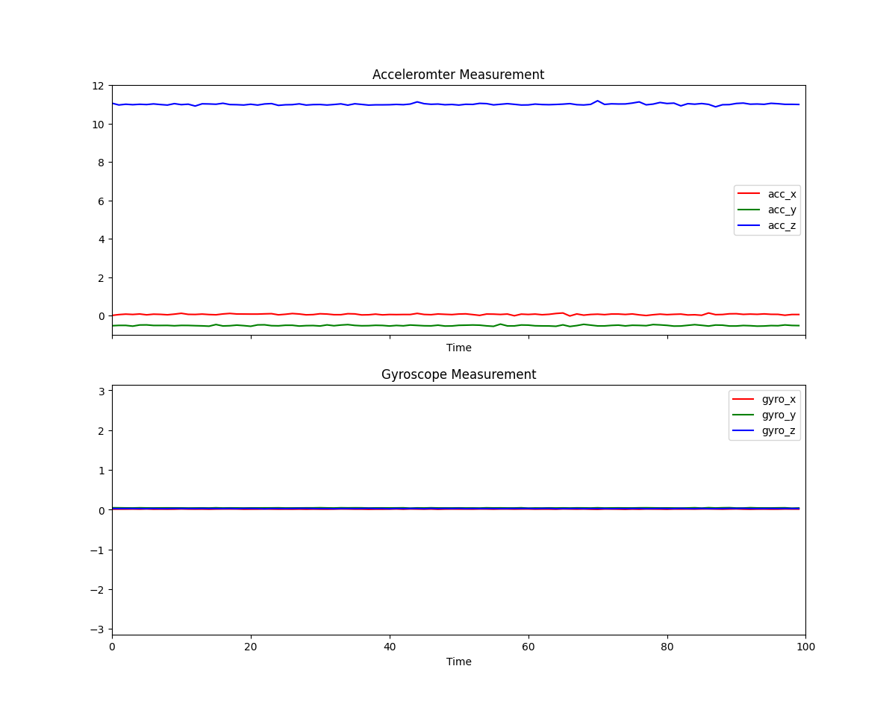

# cuppa client code

  
  

To use this, install PySerial into a modern python version. This was tested with 3.10 on Ubuntu 22.04. Other operating systems and python versions should work, within reason. Commands for Ubuntu are below.

```
python3 -m venv venv
source venv/bin/activate
pip install -r requirements_serial.txt
python3 visualize_sensor_data.py
```

